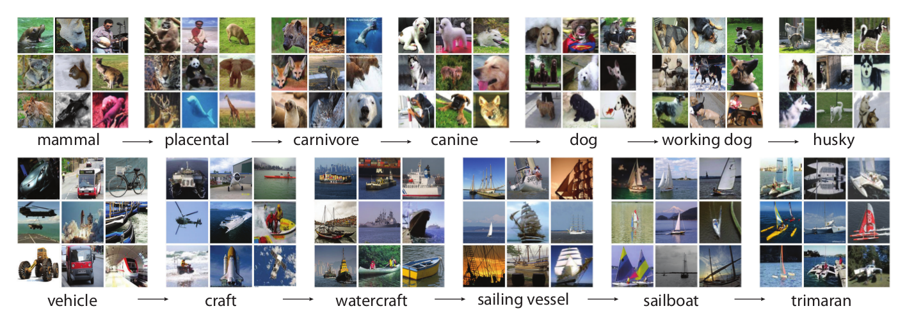
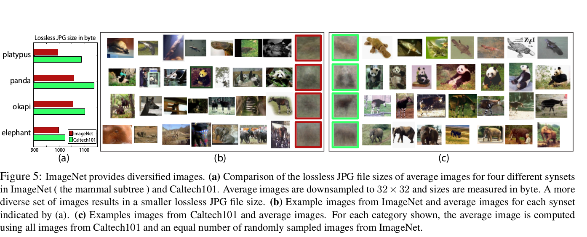
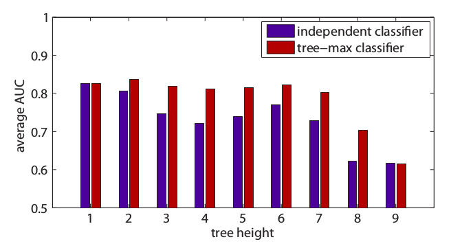

# ImageNet: A large-scale hierarchical image database

We say that a machine learning or a computer vision task is a success, when this is capable of perform good enough in a bunch of different scenarios. But this success relies on the dataset used to train a model, therefore, our focus is not longer just the algorithm but the data, and this is where *ImageNet* comes.

*ImageNet* is a hierarchical database to store full resolution images built on the structure of [WordNet](https://wordnet.princeton.edu/) ,with the aim of being a *"critical resource for developing advanced, large-scale content-based image search and image understanding, as well as for providing critical training and benchmarking data for such algorithms"*. 

*ImageNet* in its current state offers 21841 noun synsets (synset stands for *"synonym set"*) indexed and 14,197,122 images in total, with the aim to provide on average 500-1000 images to illustrate each synset. The image below shows a snapshot of two branches:

#### Scale and Hierarchy

Within a synset, each category contains a considerable number of images, which means that the database provides enough information for each part of the tree (from the most general description to the most specific one). Proving that the distribution of the images is balanced. Among the most remarkable characteristics of *ImageNet* we have: 

- *ImageNet* organizes the different classes of images in a densely populated semantic hierarchy.
- Similarly to *WordNet*, synsets of images in *ImageNet* are interlinked by several types of relations, the “IS-A” relation being the most comprehensive and useful.

#### Accuracy

*ImageNet* offers a clean dataset at all levels of the hierarchy, with a labelling precision of 99.7% on average. The way they collected the dataset was by querying several image search engines, for each synset the queries are the set of WordNet synonyms, after that, they rely on humans to verify each candidate image collected for a given synset.
 

#### Diversity

ImageNet guarantees that computational vision tasks will be developed on a sufficiently diverse data set, so, objects in images should have variable appearances, positions, view points, poses as well as background clutter and occlusions.
They deal with this problem in a fascinating way, which is, computing the average image of each synset and measure lossless JPG file size, with the idea that a synset with diversity images will result in a blurried average image, therefore its size should be smaller than a synset with less diversity that contains a more structured average image.

#### Exciting applications

There are tons of cool things that could be done using such a good image database, but in the paper they showed one that caught my attention: **_Tree Based Image Classification_** which is described as follow:

_Imagine you have a classifier at each synset node of the tree and you want to decide whether an image contains an object of that synset or not. The idea is to not only consider the classification score at a node such as “dog”, but also of its child synsets, such as “German shepherd”, “English terrier”, etc. The maximum of all the classifier responses in this subtree becomes the classification score of the query image._

And this clever idea, actually outperformed a "simple" classifier, the results obtained were outstanding. [*The tree height of a node is defined as the length of the longest path to its leaf nodes.*]:

## Summary

Create this structured database for images allows performing computational vision tasks and solving problems of classification and object detection, also it has several advantages thanks to its main characteristics **(a)** High definition images, that allow algorithms to have a better performance and **(b)** The hierarchical structure can be used to train sophisticated models that perform better compared to those trained in a "flat" dataset.

Imagenet is the beginning of a centralized handy site with clean and bias-free data that becomes a useful resource for computational vision tasks, and cientific benchmarking. 

## For further details

Visit: https://ieeexplore.ieee.org/document/5206848