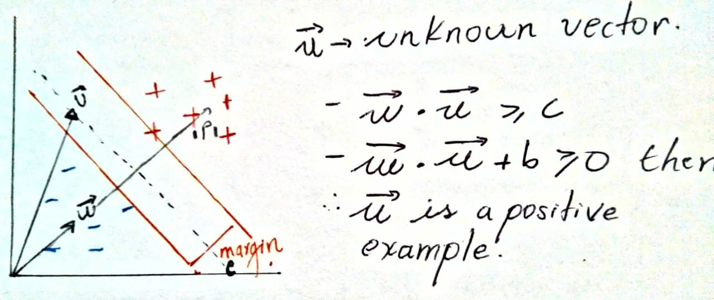

# A Training Algorithm for Optimal Margin Classifiers

## Intuiton

Classifiers with a large number of adjustable parameters are likely to overfit with the training data and be hopeless with generalization; Conversely, a classifier with insufficient capacity might not be able to learn the task at all.
The paper describes a training algorithm that automatically tunes the capacity of the classication function by maximizing the margin between training examples and class boundary. This summary joins the paper ideas and the intuiton explained in the classroom.

The following image shows the main idea, lets say we have some examples, in the "right" side of the street we have positive examples and in the left side of the "street" we have negative examples.

We don't know the **W** vector yet, but we know that this vector is perpendicular to the gutters, so, the dot product between **W** and the unknown **U** vector will give us the proyection **P** that lead us to the following conclusion:

Now, we want to insist if the unknown vector is a positive example or a negative example must be as far as possible from the decision boundary, this can be achivied by:

$ \sum_{\forall i}{x_i^{2}} $

## Section 2

Nulla vitae elit libero, a pharetra augue. Cras justo odio, dapibus ac facilisis in, egestas eget quam. Cras mattis consectetur purus sit amet fermentum. Cum sociis natoque penatibus et magnis dis parturient montes, nascetur ridiculus mus.
